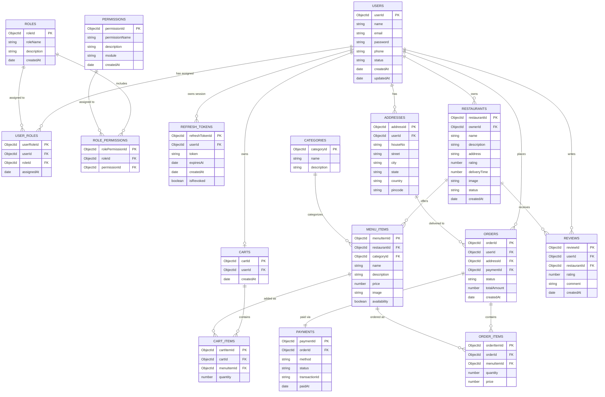

# Cravon ER Diagram

This document contains the Entity Relationship (ER) Diagram for the Cravon food ordering platform.

## Database Relationships

```mermaid
erDiagram
    USERS ||--o{ USER_ROLES : "has assigned"
    ROLES ||--o{ USER_ROLES : "assigned to"
    
    ROLES ||--o{ ROLE_PERMISSIONS : "includes"
    PERMISSIONS ||--o{ ROLE_PERMISSIONS : "assigned to"
    
    USERS ||--o{ REFRESH_TOKENS : "owns session"
    USERS ||--o{ ADDRESSES : "has"
    USERS ||--o| CARTS : "owns"
    
    CARTS ||--o{ CART_ITEMS : "contains"
    MENU_ITEMS ||--o{ CART_ITEMS : "added as"
    
    USERS ||--o{ ORDERS : "places"
    ADDRESSES ||--o{ ORDERS : "delivered to"
    ORDERS ||--o{ ORDER_ITEMS : "contains"
    MENU_ITEMS ||--o{ ORDER_ITEMS : "ordered as"
    ORDERS ||--|| PAYMENTS : "paid via"
    
    USERS ||--o{ REVIEWS : "writes"
    RESTAURANTS ||--o{ REVIEWS : "receives"
    
    USERS ||--o{ RESTAURANTS : "owns"
    RESTAURANTS ||--o{ MENU_ITEMS : "offers"
    CATEGORIES ||--o{ MENU_ITEMS : "categorizes"

    USERS {
        ObjectId userId PK
        string name
        string email
        string password
        string phone
        string status
        date createdAt
        date updatedAt
    }

    ROLES {
        ObjectId roleId PK
        string roleName
        string description
        date createdAt
    }

    PERMISSIONS {
        ObjectId permissionId PK
        string permissionName
        string description
        string module
        date createdAt
    }

    USER_ROLES {
        ObjectId userRoleId PK
        ObjectId userId FK
        ObjectId roleId FK
        date assignedAt
    }

    ROLE_PERMISSIONS {
        ObjectId rolePermissionId PK
        ObjectId roleId FK
        ObjectId permissionId FK
    }

    RESTAURANTS {
        ObjectId restaurantId PK
        ObjectId ownerId FK
        string name
        string description
        string address
        number rating
        number deliveryTime
        string image
        string status
        date createdAt
    }

    CATEGORIES {
        ObjectId categoryId PK
        string name
        string description
    }

    MENU_ITEMS {
        ObjectId menuItemId PK
        ObjectId restaurantId FK
        ObjectId categoryId FK
        string name
        string description
        number price
        string image
        boolean availability
    }

    CARTS {
        ObjectId cartId PK
        ObjectId userId FK
        date createdAt
    }

    CART_ITEMS {
        ObjectId cartItemId PK
        ObjectId cartId FK
        ObjectId menuItemId FK
        number quantity
    }

    ADDRESSES {
        ObjectId addressId PK
        ObjectId userId FK
        string houseNo
        string street
        string city
        string state
        string country
        string pincode
    }

    ORDERS {
        ObjectId orderId PK
        ObjectId userId FK
        ObjectId addressId FK
        ObjectId paymentId FK
        string status
        number totalAmount
        date createdAt
    }

    ORDER_ITEMS {
        ObjectId orderItemId PK
        ObjectId orderId FK
        ObjectId menuItemId FK
        number quantity
        number price
    }

    PAYMENTS {
        ObjectId paymentId PK
        ObjectId orderId FK
        string method
        string status
        string transactionId
        date paidAt
    }

    REVIEWS {
        ObjectId reviewId PK
        ObjectId userId FK
        ObjectId restaurantId FK
        number rating
        string comment
        date createdAt
    }

    REFRESH_TOKENS {
        ObjectId refreshTokenId PK
        ObjectId userId FK
        string token
        date expiresAt
        date createdAt
        boolean isRevoked
    }
```
